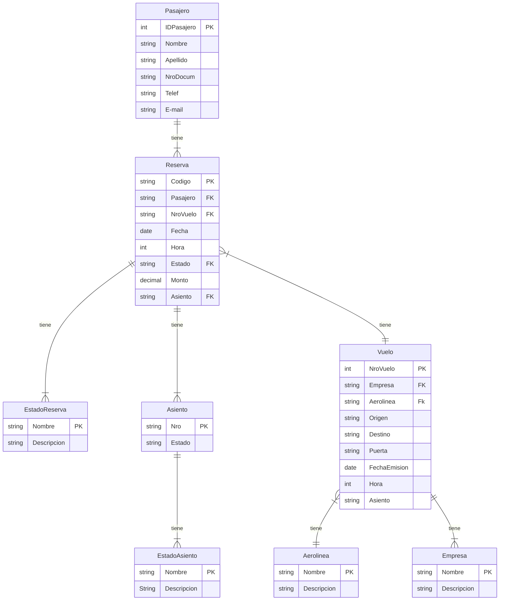

```mermaid
    erDiagram
    Pasajero{
        int IDPasajero PK
        string Nombre
        string Apellido
        string NroDocum
        string Telef
        string E-mail
    }

    Pasajero 1--1+ Reserva: tiene

    Reserva{
        string Codigo PK
        string Pasajero FK
        string NroVuelo FK
        date Fecha
        int Hora
        string Estado FK
        decimal Monto
        string Asiento FK
    }

    Reserva 1--1+ EstadoReserva: tiene

    EstadoReserva{
        string Nombre PK
        string Descripcion
    }

    Reserva 1--1+ Asiento: tiene

    Asiento{
        string Nro PK
        string Estado
    }

    Asiento 1--1+ EstadoAsiento: tiene

    EstadoAsiento{
        string Nombre PK
        String Descripcion 
    }

    Reserva 1+--1 Vuelo: tiene

    Vuelo{
        int NroVuelo PK
        string Empresa FK
        string Aerolinea Fk
        string Origen
        string Destino
        string Puerta
        date FechaEmision
        int Hora
        string Asiento
    }

    Vuelo 1+--1 Aerolinea: tiene

    Aerolinea{
        string Nombre PK
        string Descripcion
    }

    Vuelo 1--1+ Empresa: tiene

    Empresa{
        string Nombre PK
        string Descripcion
    }
```

#Correción: Falta Embarque
#Nota: Todo objeto fisico que se utilizan luego para confirmación se guardan en la base de datos